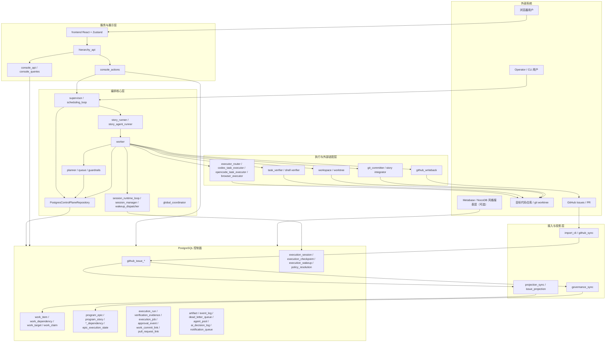
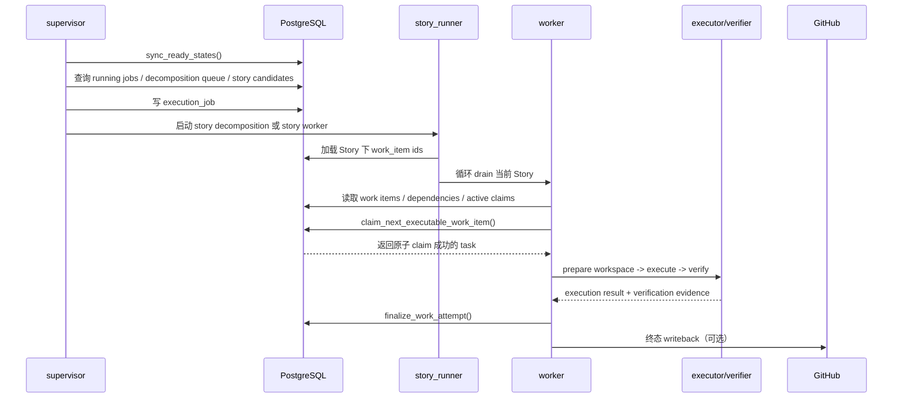

# Taskplane Architecture Overview

> 最后更新：2026-04-06

本文档描述**当前仓库实现**的总体架构，用来回答三个问题：

1. 系统分成哪些层
2. 任务从 GitHub 进入到执行完成的主链路是什么
3. 哪些表和模块分别承载哪些职责

如果你更关心“哪些部分是可复用底座、哪些部分是 Stardrifter 参考适配层”，优先看 `docs/substrate-architecture.md`。

## 1. 一句话定位

这是一个以 PostgreSQL 为控制面事实源的 AI 编排系统。

- GitHub 负责 intake 与外部回写
- PostgreSQL 负责 work graph、claim、execution、verification、session、job 等编排状态
- Python 编排核心负责调度、执行、验证、终态落库
- FastAPI + React 负责操作台和可观测面

## 2. 分层总览



## 3. 主执行链路

### 3.1 GitHub -> 控制面

```text
GitHub Issues
  -> import_cli / github_sync
  -> github_issue_import_batch / github_issue_snapshot / github_issue_normalized / github_issue_relation
  -> projection_sync_cli
  -> work_item / work_dependency / work_target
  -> governance_sync_cli
  -> program_epic / program_story / program_*_dependency
```

这一段把 GitHub issue 体系拆成两套视图：

- 执行视图：`work_item`、`work_dependency`
- 治理视图：`program_epic`、`program_story`

两者共享同一个 PostgreSQL 控制面，但职责不同。

### 3.2 自然语言 intake -> review -> promotion

```text
Operator / Console / CLI
  -> hierarchy_api / intake_cli
  -> natural_language_intent
  -> answer / approve / reject / revise
  -> promoted_epic_issue_number
  -> program_epic / program_story / work_item
```

这一段把自然语言入口拆成两层事实：

- proposal / review 事实：`natural_language_intent`
- canonical promotion 事实：`program_epic`、`program_story`、`work_item`

当前实现里，CLI 只提供 submit / answer / approve；`reject` / `revise` 由控制台 / API 入口完成，review metadata 会持续写回 `natural_language_intent`，不会直接改写执行真相。

控制台还提供 operator request ack；repository / scheduler 边界也已经拆成更窄的协议，例如 `ReadyStateSyncRepository` 和 `SupervisorSchedulingRepository`，用来把就绪态同步和调度读写分离。

### 3.3 Supervisor -> Story -> Worker



当前真实边界是：

- `supervisor` 负责挑机会、启动进程、登记 `execution_job`
- `story_runner` 负责按 Story drain 一组 task
- `worker` 负责单次 task 级生命周期
- `repository` 才是 claim / finalize 的权威边界

## 4. Worker 内部生命周期

`worker.run_worker_cycle()` 的主顺序是：

1. `_prepare_worker_queue(...)`
2. `repository.claim_next_executable_work_item(...)`
3. `workspace_manager.prepare(...)`
4. `_run_executor_with_optional_session_runtime(...)`
5. verifier
6. `repository.finalize_work_attempt(...)`
7. `workspace_manager.release(...)`
8. 可选 GitHub writeback

这里最重要的设计点是：

- queue evaluation 发生在 worker
- authoritative claim 发生在 repository
- DB terminalization 先于外部 writeback
- workspace 只管理 worktree 生命周期，不拥有 claim 真相

## 5. 关键模块分工

### 5.1 控制面内核

- `repository/`
  - PostgreSQL 控制面实现
  - 负责 claim、lease、finalize、retry/backoff、approval event、story/governance 状态传播
- `planner.py`
  - ready 状态推导
- `queue.py`
  - executable / blocked 候选评估
- `guardrails.py`
  - wave、lane、冻结前缀、审批等执行前拦截

### 5.2 编排运行时

- `scheduling_loop.py`
  - supervisor 单轮调度主逻辑
- `story_runner.py`
  - Story 粒度 drain 执行
- `worker.py`
  - task 粒度执行壳层
- `session_runtime_loop.py`
  - 多轮 session/checkpoint/wakeup 机制

### 5.3 接入与参考适配层

- `github_sync.py` / `github_importer.py`
  - GitHub issue intake
- `projection_sync.py` / `issue_projection.py`
  - staging -> work graph
- `governance_sync.py`
  - staging -> epic/story 治理层
- `github_writeback.py`
  - 终态回写 GitHub

### 5.4 操作台与可视化

- `hierarchy_api.py`
  - FastAPI 应用入口、静态资源托管、REST API 暴露
- `console_api.py` / `console_queries/`
  - 只读查询模型
- `console_actions.py`
  - split / retry 等控制面动作
- `frontend/`
  - React + Zustand 控制台源码
  - 构建产物写入 `src/taskplane/static/`

## 6. 关键数据表职责

### 6.1 接入层

- `github_issue_import_batch`
- `github_issue_snapshot`
- `github_issue_normalized`
- `github_issue_relation`

职责：保留 GitHub 原始与归一化 issue 视图，作为 projection / governance sync 的输入。

### 6.2 执行控制面

- `work_item`
- `work_dependency`
- `work_target`
- `work_claim`

职责：表达可执行 work graph、路径占用、当前 claim、重试与调度状态。

### 6.3 治理层

- `program_epic`
- `program_story`
- `program_epic_dependency`
- `program_story_dependency`
- `epic_execution_state`

职责：表达 Story / Epic 层次结构、依赖与执行推进状态。

### 6.4 执行证据与终态

- `execution_run`
- `verification_evidence`
- `work_commit_link`
- `pull_request_link`
- `approval_event`
- `story_integration_run`
- `story_verification_run`

职责：持久化尝试结果、验证结果、提交/PR 链接和审批事件。

### 6.5 进程与会话

- `execution_job`
- `execution_session`
- `execution_checkpoint`
- `execution_wakeup`
- `policy_resolution`

职责：分别表达进程级 job 跟踪，以及多轮 AI session 的 checkpoint / suspend / wakeup 状态。

### 6.6 可观测与恢复

- `artifact`
- `event_log`
- `dead_letter_queue`
- `agent_pool`
- `ai_decision_log`
- `notification_queue`

职责：补充 artifact 引用、事件日志、失败移入 DLQ、多 agent 运行记录和通知通道。

### 6.7 提案与审核边界

- `story_task_draft`
- `natural_language_intent`

职责：分别承载 intake 生成的 task 草案与自然语言 proposal / review 记录。它们属于控制面边缘事实，不是 worker 直接消费的运行态真相；只有显式 review 通过后，promotion 才会进入 `program_epic / program_story / work_item`。

## 7. 当前最值得记住的架构结论

### 7.1 PostgreSQL 是编排真相源

GitHub 不是状态机真相。GitHub 更像：

- 输入源
- operator 可见界面的一部分
- 外部 writeback 目标

### 7.2 Repository 是权威执行边界

不是 `worker` 直接决定“执行哪个 task”，而是：

- worker 给出候选
- repository 在事务边界内完成 claim
- repository 在终态边界内完成 finalize

### 7.3 Story 是执行分组，不是底座唯一抽象

当前实现明显以 Story 为 drain 和合并边界，但这属于参考治理模型，不应和底座控制面混为一谈。

### 7.4 UI 是控制面读模型，不是独立业务后端

FastAPI / React 主要消费控制面表和查询 SQL，本质上是 operator console，而不是另一套业务核心。

### 7.5 自然语言提案是控制面事实，不是执行真相

`natural_language_intent` 记录 prompt、proposal、clarification 和 review metadata。review 决策必须是结构化事实，而不是停留在前端临时状态或文本备注里。

## 8. 推荐阅读顺序

1. 本文：先建立“当前实现”全局图
2. `docs/substrate-architecture.md`：看底座与适配层边界
3. `docs/mvp-design.md`：看 claim、worker、状态机设计
4. `docs/program-governance-model.md`：看 Epic/Story 治理模型
5. `sql/control_plane_schema.sql`：看最终事实表
